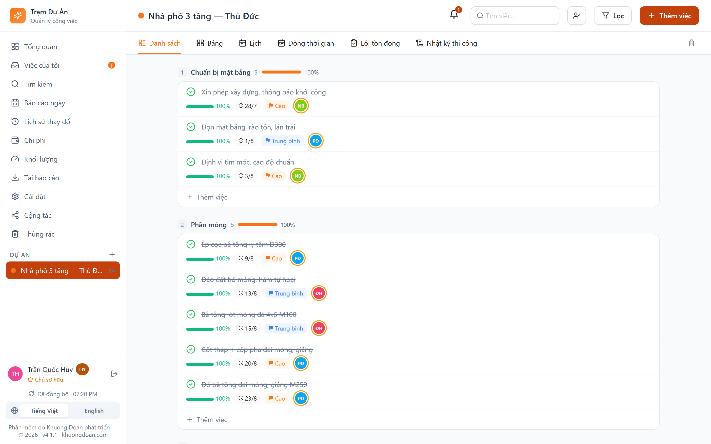
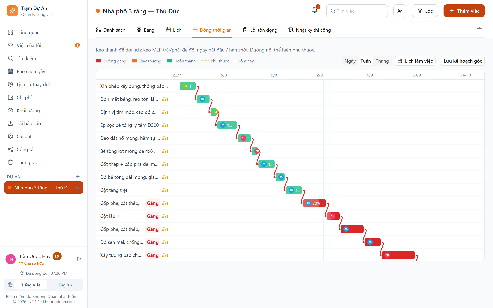
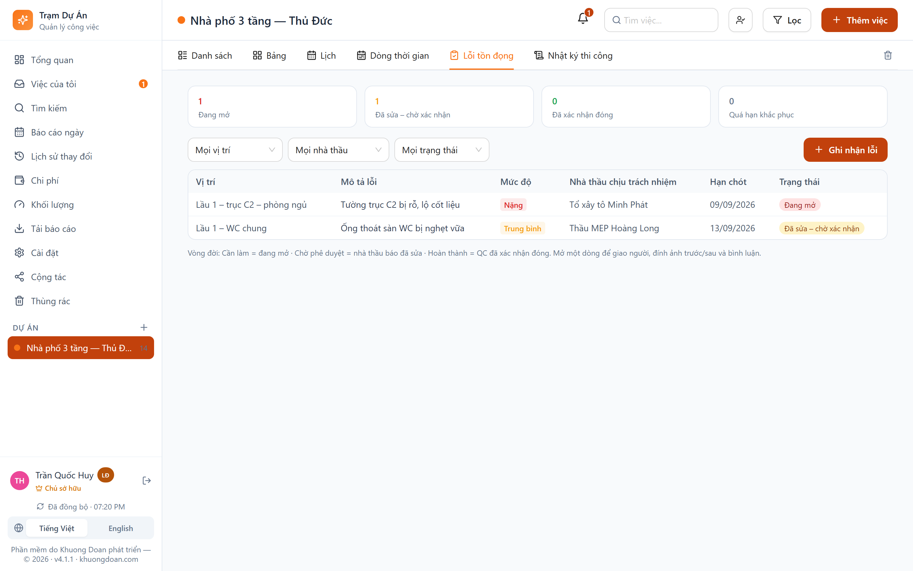
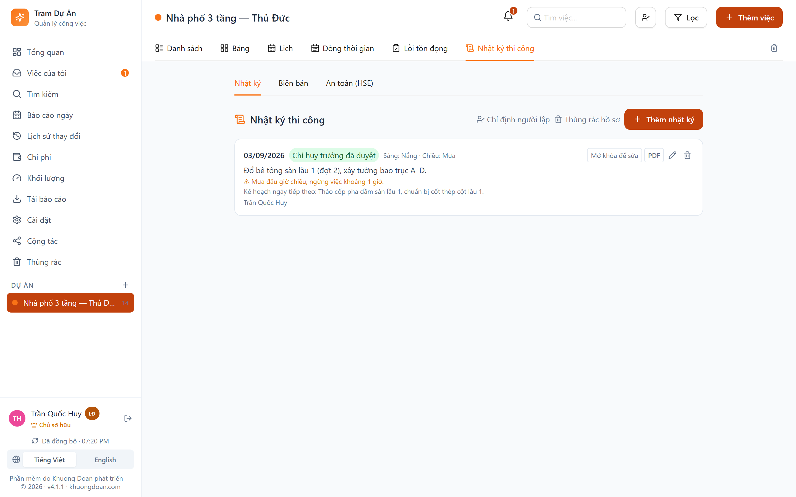
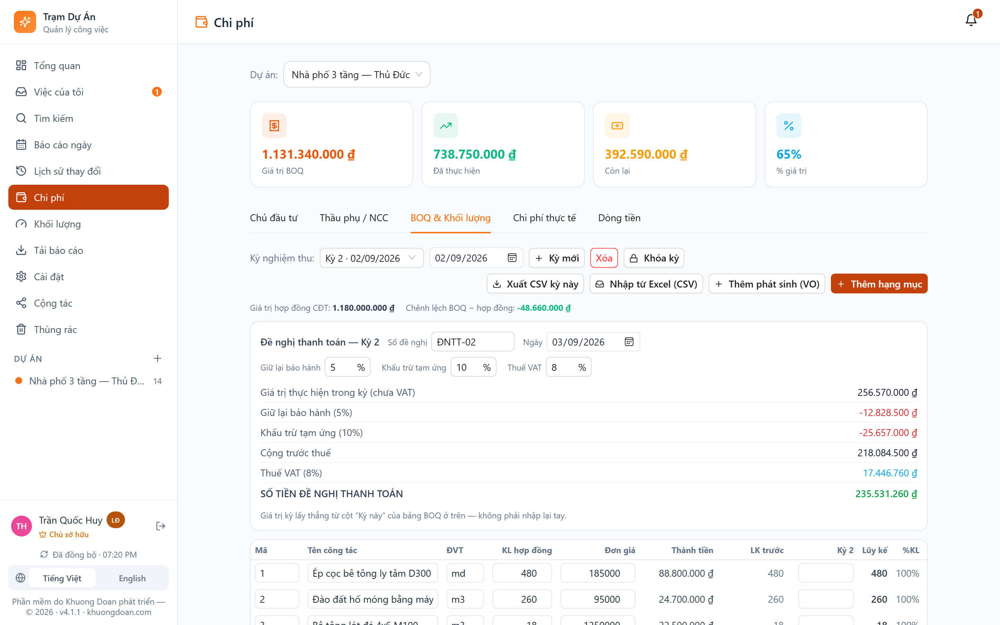
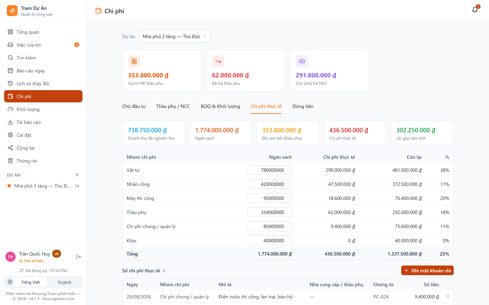
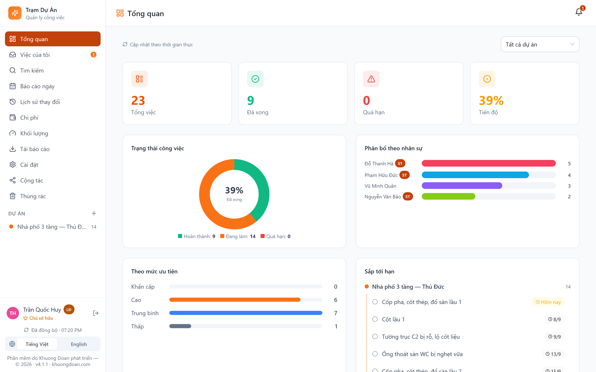
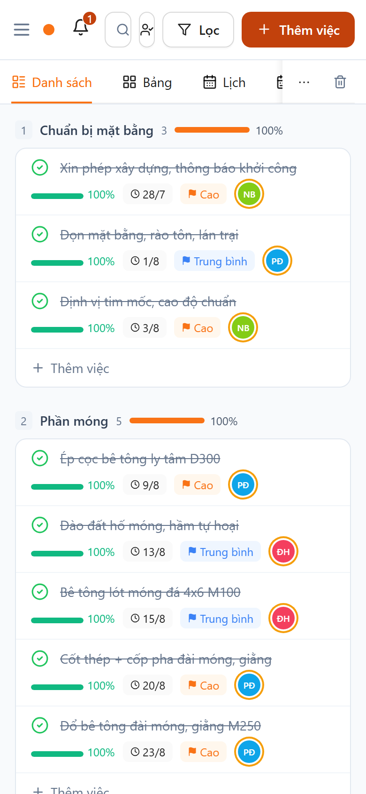

# Trạm Dự Án

**Phần mềm quản lý thi công cho công ty xây dựng — chạy trên máy công ty, dữ liệu không rời khỏi công ty.**

Kiểu Asana nhưng làm cho ngành xây dựng: WBS theo giai đoạn, đường găng theo ngày làm việc
thật, nhật ký thi công có bảng nhân lực/máy/khối lượng, punch list, bảng kiểm nghiệm thu,
BOQ theo kỳ nghiệm thu, phát sinh (VO), ngân sách – chi phí thực tế, đề nghị thanh toán.

Miễn phí, mã nguồn mở theo giấy phép MIT. Không hạn dùng thử, không mã kích hoạt.

- **Tác giả:** Khuong Doan — <https://khuongdoan.com/>
- **Phiên bản hiện tại:** xem [CHANGELOG.md](CHANGELOG.md)

---

## Dùng ngay

Phần mềm được phát hành thành **hai thư mục độc lập**, giống hệt nhau về tính năng, khác
nhau ở cách chạy. Chọn một:

| Bạn muốn | Dùng thư mục | Hướng dẫn |
|---|---|---|
| Chạy thử, hoặc công ty nhỏ có 1 máy luôn bật | `Chạy nội bộ/` | [HƯỚNG DẪN 1 — Chạy trên máy cá nhân](Chạy%20nội%20bộ/HƯỚNG%20DẪN%201%20-%20Chạy%20trên%20máy%20cá%20nhân.txt) |
| Công ty có NAS, chạy 24/7 (khuyên dùng) | `Chạy trên NAS/` | [HƯỚNG DẪN 2 — Chạy trên NAS công ty](Chạy%20trên%20NAS/HƯỚNG%20DẪN%202%20-%20Chạy%20trên%20NAS%20công%20ty.txt) |
| Cần truy cập từ Internet qua tên miền riêng | `Chạy trên NAS/` | [HƯỚNG DẪN 3 — Đưa lên hosting và tên miền](Chạy%20trên%20NAS/HƯỚNG%20DẪN%203%20-%20Đưa%20lên%20hosting%20và%20tên%20miền.txt) |

Chạy nhanh nhất (cần [Node.js](https://nodejs.org) bản LTS):

```bash
cd "Chạy nội bộ" && node server.js
# mở http://localhost:3000, dùng MÃ CÀI ĐẶT in ra ở cửa sổ dòng lệnh để tạo tài khoản Chủ sở hữu
```

> **Trước khi mở ra Internet**, đọc mục 5 của HƯỚNG DẪN 3. Phần mềm được thiết kế cho mạng
> nội bộ; đưa ra Internet cần thêm HTTPS, tường lửa và các bước siết bảo mật nêu trong đó.

---

## Giao diện

> Ảnh chụp từ dữ liệu mẫu — tên người, tên dự án và mọi con số đều là hư cấu.

### Tiến độ theo giai đoạn thi công
Gom việc theo giai đoạn (WBS) thay vì chỉ theo trạng thái. Mỗi giai đoạn có mã số và
**% hoàn thành tính theo trọng số thời lượng** — việc 10 ngày nặng gấp 5 lần việc 2 ngày.



### Đường găng tính theo ngày công thật
Thanh **đỏ** là đường găng — trễ một ngày là cả dự án trễ một ngày. Đường nối là quan hệ phụ
thuộc (FS/SS/FF/SF, có độ trễ). Vạch xanh là hôm nay. Chủ nhật và ngày lễ không tính vào
ngày công. Kéo thanh để dời lịch, kéo mép để đổi thời lượng; xem theo Ngày / Tuần / Tháng.



### Lỗi tồn đọng (punch list)
Ghi vị trí (tầng – trục – phòng), mức độ, nhà thầu chịu trách nhiệm, hạn khắc phục, ảnh
trước và sau. Lọc theo vị trí / nhà thầu / trạng thái. Vòng đời bám đúng luồng duyệt sẵn có:
*Đang mở → Nhà thầu báo đã sửa → QC xác nhận đóng*.



### Nhật ký thi công có cấu trúc
Bảng nhân lực theo tổ đội, bảng máy theo giờ, khối lượng gắn hạng mục BOQ (là số nên cộng
dồn được), mục sự cố tách riêng, và luồng *Nháp → Đã nộp → Chỉ huy trưởng duyệt* — duyệt
xong là khóa sửa. In được theo mẫu NĐ 06/2021.



### BOQ theo kỳ nghiệm thu và đề nghị thanh toán
Khối lượng nhập theo từng kỳ, lũy kế tự tính lại nên sửa kỳ cũ thì kỳ sau vẫn đúng. Kỳ đã
nộp Chủ đầu tư **khóa được** (máy chủ chụp lại đơn giá, sửa giá về sau không đổi số đã nộp).
Đề nghị thanh toán sinh thẳng từ giá trị kỳ — trừ giữ lại bảo hành, khấu trừ tạm ứng, cộng VAT.



### Ngân sách so với chi phí thực tế
Sáu nhóm chi phí, sổ chi phí thực tế có chứng từ và nhà cung cấp, đối chiếu
*Doanh thu đã nghiệm thu – Ngân sách – Đã cam kết – Thực tế* và **lãi gộp tạm tính**.



### Tổng quan cho lãnh đạo


### Dùng được ngoài công trường
Tên việc chiếm dòng riêng trên điện thoại; chụp ảnh mở thẳng camera; ảnh được nén trên máy
trước khi tải lên (ảnh 11 MB còn khoảng 450 KB); nhập bằng giọng nói; mất sóng vẫn thao tác
được và tự gửi lại khi có mạng.



---

## Tính năng

**Tiến độ** — WBS theo giai đoạn với % trọng số thời lượng · phụ thuộc FS/SS/FF/SF có
lag/lead · lịch làm việc riêng từng dự án (ngày nghỉ, ngày lễ) · đường găng CPM tính trên
ngày công thật · kế hoạch gốc (baseline) · mốc (milestone) · Gantt zoom Ngày/Tuần/Tháng,
kéo thả đổi lịch, ảo hóa dòng nên mượt ở dự án 1.000 việc.

**Hiện trường** — nhật ký thi công có bảng nhân lực theo tổ đội, bảng máy theo giờ, bảng
khối lượng gắn hạng mục BOQ, mục sự cố/mất an toàn riêng, luồng Nháp → Đã nộp → Chỉ huy
trưởng duyệt (duyệt xong là khóa) · in theo mẫu NĐ 06/2021 · chụp ảnh thẳng từ camera, nén
ảnh trên máy trước khi tải lên · nhập bằng giọng nói.

**Chất lượng & an toàn** — punch list (vị trí, mức độ, nhà thầu, hạn khắc phục, ảnh
trước/sau) · 8 mẫu bảng kiểm nghiệm thu Đạt/Không đạt/N-A, mục không đạt tự sinh lỗi tồn
đọng · tab An toàn (HSE): ngày không tai nạn, sổ sự cố, họp an toàn đầu giờ, giấy phép làm việc.

**Chi phí** — BOQ theo kỳ nghiệm thu (không lưu lũy kế, tính lại từ các kỳ) · phát sinh VO
có trạng thái duyệt · khóa kỳ đã nộp Chủ đầu tư (chụp lại đơn giá) · ngân sách theo nhóm và
sổ chi phí thực tế, lãi gộp · đề nghị thanh toán (giữ lại, khấu trừ tạm ứng, VAT) · xuất CSV.

**Vận hành** — phân quyền phía máy chủ theo từng trường · thành viên theo dự án · nhật ký
kiểm toán chỉ-thêm do máy chủ tự ghi · làm việc được khi mất mạng (hàng đợi + tự gửi lại) ·
gộp ba chiều khi hai người lưu cùng lúc · ghi tệp nguyên tử + snapshot 14 ngày + email sao
lưu hằng tuần · HTTPS tự bật khi có chứng chỉ · song ngữ Việt/Anh.

---

## Cấu trúc mã nguồn

```
Chạy nội bộ/            bản chạy trên một máy Windows/macOS/Linux   ← NGUỒN CHUẨN
Chạy trên NAS/          bản chạy Docker (NAS công ty hoặc VPS)
  server.js               máy chủ: Node thuần, không framework — API + phân quyền + lưu vết
  ProjectManager.jsx      toàn bộ giao diện React (chỉ sửa ở bản "Chạy nội bộ")
  public/app.js           bundle sinh ra từ ProjectManager.jsx — KHÔNG sửa tay
build/                  npm run build     dựng app.js cho CẢ HAI bản + đóng dấu hash vào ?v=
                        npm run dong-goi  đóng gói 2 zip phân phối vào ../files
tests/                  bộ kiểm thử tự động — xem tests/README.md
docs/                   tài liệu kỹ thuật, sách hướng dẫn, các báo cáo đánh giá độc lập
```

Hai thư mục `Chạy nội bộ` và `Chạy trên NAS` **phải giống nhau từng byte** ở
`server.js`, `ProjectManager.jsx`, `public/shim.js`, `public/app.js`.
`build/build.mjs` tự đồng bộ khi build; bộ kiểm thử chặn nếu lệch.

### Kiến trúc rút gọn

- **Đồng bộ**: máy trạm giữ cả khối trạng thái, ghi qua `POST /api/kv` (key `pm_shared_v3`)
  kèm `rev` tăng dần. Máy chủ thẩm định phần thay đổi bằng `validateSharedWrite` (phân quyền
  đến từng trường) và trả 409 khi rev cũ. Poll 4 giây chỉ hỏi `GET /api/kv/rev`.
- **Xung đột**: 409 → máy trạm gộp ba chiều theo từng bản ghi thay vì tải lại bỏ hết.
- **Phạm vi dự án**: dự án có `members` thì máy chủ **lọc khi đọc** và **ghép lại khi ghi**,
  để người bị giới hạn không vô tình xóa dữ liệu họ không nhìn thấy.
- **Tài chính**: lưu riêng `finance.json`, chống ghi đè bằng CAS (`expectedRev`),
  quyền `canViewFinance` / `canEditFinance` tách rời.
- **Lưu vết**: `audit.jsonl` chỉ-thêm, do máy chủ tự sinh từ phần diff — không ai xóa được
  qua ứng dụng.
- **An toàn dữ liệu**: ghi JSON nguyên tử + `.bak`, snapshot hằng ngày (giữ 14), email sao
  lưu thứ Bảy, thùng rác 90 ngày cho dự án và hồ sơ.

---

## Phát triển

```bash
# Dựng lại giao diện sau khi sửa "Chạy nội bộ/ProjectManager.jsx"
cd build && npm install && npm run build

# Chạy thử với dữ liệu riêng (đừng trỏ vào dữ liệu thật)
DATA_DIR=/duong/dan/trong PORT=3211 SETUP_CODE=TEST123 node "Chạy nội bộ/server.js"

# Cổng kiểm soát trước khi phát hành — MỘT lệnh, tự bật/tắt máy chủ
node tests/kiem-tra-tat-ca.mjs

# Đóng gói 2 zip giao khách vào ../files
cd build && npm run dong-goi
```

`node tests/kiem-tra-tat-ca.mjs` chạy toàn bộ bộ kiểm thử, kiểm HTTPS, đối chiếu hai bản và
kiểm tra gói phân phối; in **"ĐỦ ĐIỀU KIỆN PHÁT HÀNH"** hoặc **"CHƯA ĐẠT"** (thoát mã 1).

### Quy trình phát hành

1. Bump version ở **cả hai** `package.json`.
2. `cd build && npm run build`.
3. `node tests/kiem-tra-tat-ca.mjs` — phải "ĐỦ ĐIỀU KIỆN PHÁT HÀNH".
4. Cập nhật `CHANGELOG.md` và `CÓ GÌ MỚI.txt` của cả hai bản.
   **Thay đổi hành vi** (quyền, mặc định, luồng làm việc) phải nêu ở ĐẦU "CÓ GÌ MỚI".
5. `cd build && npm run dong-goi`.
6. `git commit` → `git tag vX.Y.Z` → `git push --tags`.
7. Giải nén thử zip, chạy `node server.js`, đăng nhập một lần trước khi giao khách.

---

## Đóng góp

Rất hoan nghênh báo lỗi và đề xuất qua Issues. Nếu gửi Pull Request:

- Sửa giao diện thì sửa `Chạy nội bộ/ProjectManager.jsx` rồi chạy `npm run build`;
  **đừng sửa tay** `public/app.js`.
- Mọi thay đổi phải qua `node tests/kiem-tra-tat-ca.mjs`.
- Thay đổi chạm tới phân quyền, tiền bạc hoặc xóa dữ liệu thì **kèm ca kiểm thử**.
- Ghi chú trong mã bằng tiếng Việt, giải thích *vì sao* chứ không mô tả lại code.

Lỗ hổng bảo mật: xem [SECURITY.md](SECURITY.md) — đừng mở Issue công khai.

---

## Giấy phép

MIT — xem [LICENSE](LICENSE) (bản giải thích tiếng Việt:
[docs/Giay-phep-tieng-Viet.md](docs/Giay-phep-tieng-Viet.md)). Ai cũng được dùng, sửa và
phân phối lại cho mục đích thương mại hay phi thương mại; điều kiện duy nhất là
**giữ dòng ghi danh tác giả**. Không hạn dùng thử, không mã kích hoạt, không thu thập dữ liệu.

Phần mềm do **Khuong Doan** phát triển — <https://khuongdoan.com/>
