# Hướng dẫn sử dụng Trạm Dự Án (bản có hình)

Dành cho người **dùng** phần mềm hằng ngày: Chỉ huy trưởng, kỹ sư hiện trường, QS, kế toán, tổ trưởng,
nhân viên. Cài đặt và vận hành máy chủ xem các file "HƯỚNG DẪN 1/2/3" trong gói phát hành. Bản văn bản
thuần (không hình, kèm sẵn trong gói để gửi cho nhân viên):
[HƯỚNG DẪN SỬ DỤNG - Cho người dùng.txt](../Chạy%20nội%20bộ/HƯỚNG%20DẪN%20SỬ%20DỤNG%20-%20Cho%20người%20dùng.txt).

Áp dụng từ bản 5.0 · Ảnh chụp từ dữ liệu mẫu (tên người, dự án, số tiền đều là bịa).

**Mục lục**

0. [Đọc trong 2 phút](#0-đọc-trong-2-phút)
1. [Vai trò và quyền](#1-vai-trò-và-quyền--ai-làm-được-gì)
2. [Công việc: tạo, sửa, theo dõi](#2-công-việc-tạo-sửa-theo-dõi)
3. [Duyệt việc, quy tắc nghiệm thu, lỗi tồn đọng](#3-duyệt-việc-quy-tắc-nghiệm-thu-lỗi-tồn-đọng)
4. [Dòng thời gian (Gantt), đường găng, kế hoạch gốc](#4-dòng-thời-gian-gantt-đường-găng-kế-hoạch-gốc)
5. [Báo cáo ngày](#5-báo-cáo-ngày)
6. [Nhật ký thi công](#6-nhật-ký-thi-công)
7. [Biên bản, bảng kiểm nghiệm thu, An toàn (HSE)](#7-biên-bản-bảng-kiểm-nghiệm-thu-an-toàn-hse)
8. [Chi phí: hợp đồng, BOQ, kỳ nghiệm thu, đề nghị thanh toán](#8-chi-phí-hợp-đồng-boq-kỳ-nghiệm-thu-đề-nghị-thanh-toán)
9. [Tổng quan, Khối lượng, Lịch sử, Thông báo, Tải báo cáo, Góp ý](#9-tổng-quan-khối-lượng-lịch-sử-thông-báo-tải-báo-cáo-góp-ý)
10. [Cài đặt và quản lý thành viên](#10-cài-đặt-chủ-sở-hữu-và-quản-lý-thành-viên)
11. [Dùng trên điện thoại, khi mất mạng](#11-dùng-trên-điện-thoại-khi-mất-mạng)
12. [Câu hỏi thường gặp](#12-câu-hỏi-thường-gặp)

---

## 0. Đọc trong 2 phút

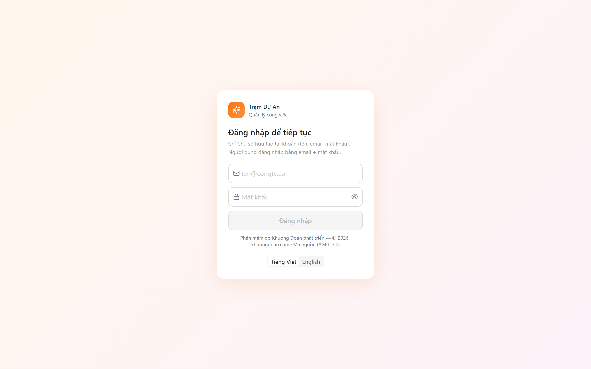

- Đăng nhập bằng email + mật khẩu do Chủ sở hữu tạo. Quên mật khẩu: nhờ Chủ sở hữu (hoặc người có
  quyền "Tạo tài khoản") đặt lại trong Quản lý thành viên.
- **Thanh bên trái**: Tổng quan, Việc của tôi, Tìm kiếm, Báo cáo ngày, Lịch sử thay đổi, Chi phí, Khối
  lượng, Tải báo cáo, Cài đặt, Cộng tác, Góp ý, Thùng rác, rồi danh sách **Dự án**. Trên điện thoại thanh
  bên ẩn sau nút Menu (☰).
- **Góc trên phải**: chuông thông báo (số chưa đọc), ô tìm trong dự án, Lọc, Thêm việc.
- **Góc dưới thanh bên**: tên bạn (bấm để đổi mật khẩu / đăng xuất), nhãn "Đã đồng bộ · giờ", nút chuyển
  Tiếng Việt / English.
- Mọi thay đổi ở công việc **tự lưu và tự đồng bộ** cho mọi người sau vài giây, không có nút Lưu. Nhật
  ký, biên bản, chi phí có nút Lưu riêng.
- Không thấy mục nào đó (Chi phí, Lịch sử, Khối lượng, Cài đặt…) là do bạn chưa được cấp quyền, hoặc
  Chủ sở hữu đã tắt tính năng đó.

---

## 1. Vai trò và quyền — ai làm được gì

**Ai cũng làm được** (không cần quyền gì): xem công việc của mọi dự án mình được vào; bình luận; cập
nhật % hoàn thành ở việc mình **phụ trách chính** (dấu ★); tick việc con; nộp Báo cáo ngày; đính kèm
tệp / ảnh vào việc mình làm; nhận thông báo; đổi mật khẩu; góp ý.

**Quyền do Chủ sở hữu cấp** (Cài đặt → Quản lý thành viên, tick từng ô):

| Quyền | Làm được gì |
|---|---|
| Giao việc | Tạo / sửa / xóa công việc, giao người, đặt nhắc việc, thêm giai đoạn, tạo dự án, ghi nhận lỗi tồn đọng |
| Chi phí | Xem mục Chi phí. Tick thêm **Sửa chi phí** mới nhập / sửa được số liệu |
| Lịch sử | Xem Lịch sử thay đổi |
| Khối lượng | Xem công suất từng người |
| Tạo tài khoản | Tạo tài khoản, phân quyền cho người khác (không tự đổi quyền của chính mình). Quyền tín nhiệm cao |
| Teamlead | Duyệt việc của bộ phận mình; Teamlead bộ phận **Site** còn lập và duyệt Nhật ký thi công |
| Lãnh đạo | Duyệt việc cấp lãnh đạo, thấy **mọi** dự án, lưu kế hoạch gốc, đổi Thành viên dự án và Quy tắc nghiệm thu, mở khóa nhật ký đã duyệt, xem Nhật ký máy chủ |
| Miễn báo cáo | Không phải nộp Báo cáo ngày (kế toán, văn phòng…) |
| Chủ sở hữu | Toàn quyền, kể cả Cài đặt, Thùng rác, xóa vĩnh viễn, xóa dự án |

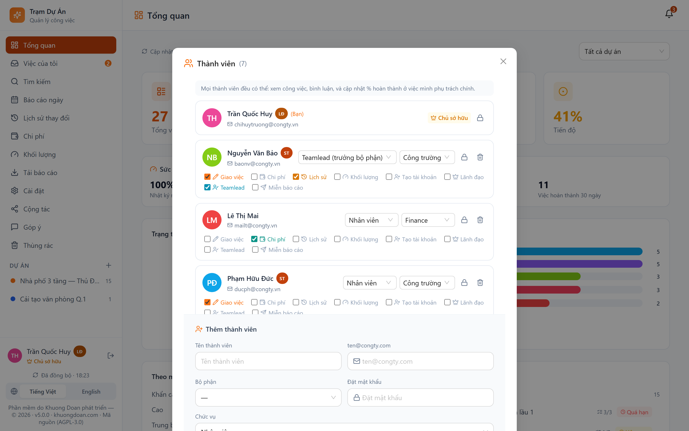

**Giới hạn theo dự án**

- **Thành viên dự án** (nút hình người ở tiêu đề dự án; Chủ sở hữu / Lãnh đạo bấm): để trống = cả
  công ty thấy; chọn người = chỉ họ (và Chủ sở hữu, Lãnh đạo) thấy dự án đó, kể cả tệp, nhật ký, biên
  bản, chi phí của nó. Dự án bị giới hạn có ổ khóa nhỏ cạnh tên.
- **Chỉ định người lập** (tab Nhật ký thi công): ai được lập nhật ký / biên bản của dự án. Teamlead Site
  trong dự án luôn được.

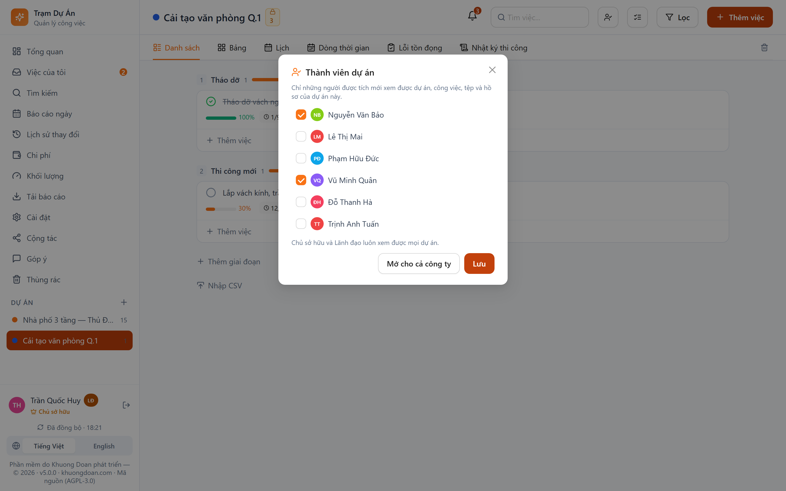

---

## 2. Công việc: tạo, sửa, theo dõi

### Tạo việc (cần quyền Giao việc)

- Nút **Thêm việc** ở tiêu đề dự án, hoặc dòng "+ Thêm việc" cuối mỗi nhóm trong Danh sách / Bảng.
- Nhập nhiều việc một lần: cuối Danh sách có **Nhập CSV** — mẫu cột hiện ngay trong hộp thoại; dán từ
  Excel cũng được.
- Tạo dự án mới (dấu + cạnh chữ DỰ ÁN) có sẵn mẫu (thi công nhà phố…) tạo luôn các giai đoạn và việc
  chuẩn.

### Cách xem một dự án

Dải nút dưới tiêu đề: **Danh sách** (nhóm theo giai đoạn hoặc theo trạng thái, nút Lọc → Nhóm theo),
**Bảng** (Kanban, kéo thẻ giữa các cột), **Lịch** (việc theo hạn chót), **Dòng thời gian** (Gantt, mục 4),
**Lỗi tồn đọng** (mục 3), **Nhật ký thi công** (mục 6, 7). Nút **Lọc** lọc theo người, ưu tiên, trạng thái,
ẩn việc xong, tìm chữ.

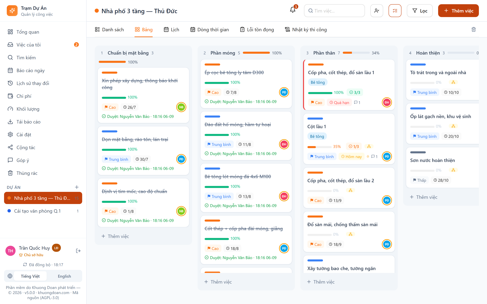

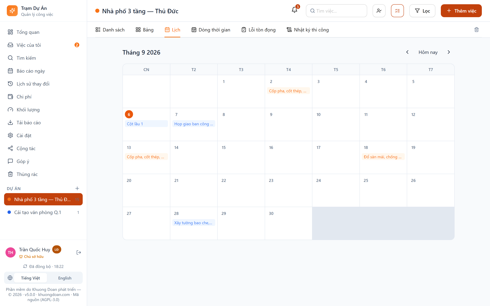

### Chi tiết việc (bấm vào tên việc — mở ngăn bên phải)

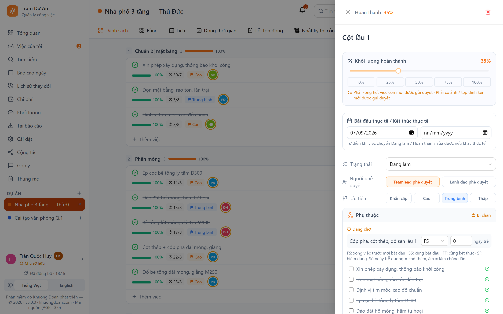

- **% Khối lượng hoàn thành**: kéo thanh hoặc bấm 0 / 25 / 50 / 75 / 100. Chỉ người phụ trách chính (★)
  hoặc người có quyền Giao việc mới sửa được. Dòng chữ cam bên dưới là Quy tắc nghiệm thu của dự án
  (mục 3).
- **Bắt đầu thực tế / Kết thúc thực tế**: tự điền khi việc chuyển Đang làm / Hoàn thành; sửa được nếu
  ngoài công trường khác. Từ đó phần mềm biết việc trễ **thật** bao nhiêu ngày.
- **Trạng thái**: Cần làm → Đang làm → Chờ phê duyệt → Hoàn thành; "On hold / Blocked" khi bị vướng.
  Việc tự chuyển sang Đang làm khi tới ngày bắt đầu.
- **Người phê duyệt**: Teamlead phê duyệt hoặc Lãnh đạo phê duyệt (mục 3).
- **Ưu tiên**: Khẩn cấp / Cao / Trung bình / Thấp.
- **Phụ thuộc**: tick các việc phải xong trước; mỗi liên kết chọn loại FS (xong trước mới bắt đầu), SS
  (cùng bắt đầu), FF (cùng kết thúc), SF (hiếm dùng) và số ngày trễ (âm = làm chồng lấn). Việc bị chặn
  có nhãn "Bị chặn"; vi phạm lịch tô đỏ trên Gantt.
- Cuộn xuống còn: **Người làm** (chọn nhiều người, một người là phụ trách chính ★), **Ngày** (Ngày bắt
  đầu, Tiến độ dự kiến, Hạn chót — nhập 2 ô, ô còn lại tự tính; "◆ Mốc" = việc không tốn ngày), **Việc
  con**, **Nhãn**, **Lặp lại** (hằng tuần / hằng tháng, xong là tự tạo việc kỳ sau), **Nhắc việc qua
  email** (trước hạn), **Bình luận** (không sửa / xóa được), **Tệp đính kèm** (tối đa 40 MB / tệp, ảnh tự
  thu nhỏ).

### Việc của tôi, Tìm kiếm, xóa việc

- **Việc của tôi**: mọi việc mình được giao ở mọi dự án, sắp theo hạn, kèm các việc đang chờ mình duyệt.
- **Tìm kiếm**: tìm tên / mô tả việc trên toàn công ty.
- Xóa việc: vào Thùng rác 90 ngày (Chủ sở hữu khôi phục / xóa hẳn). Xóa dự án chỉ Chủ sở hữu làm được.

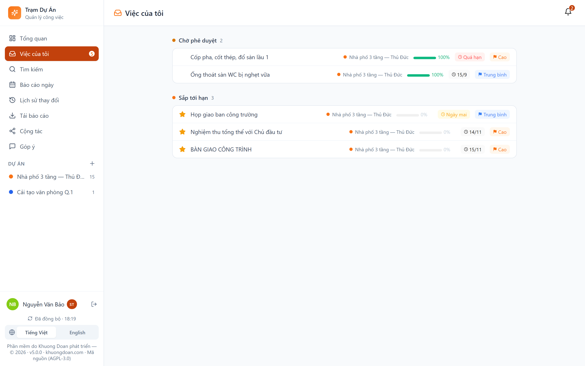

---

## 3. Duyệt việc, quy tắc nghiệm thu, lỗi tồn đọng

### Luồng duyệt

1. Người làm kéo % lên 100 → việc sang **Chờ phê duyệt** (không tự Hoàn thành được, trừ khi người phụ
   trách chính chính là Teamlead được chỉ định duyệt).
2. Người phê duyệt (Teamlead bộ phận, hoặc Lãnh đạo nếu việc đặt "Lãnh đạo phê duyệt") mở việc →
   **Phê duyệt** hoặc **Trả về** kèm lý do (bắt buộc). Trả về: việc quay lại Đang làm, lý do thành bình
   luận ⛔ và email cho người làm.
3. Việc Hoàn thành ghi tên người duyệt và giờ duyệt (hiện trên thẻ Kanban: "Duyệt: tên · giờ").

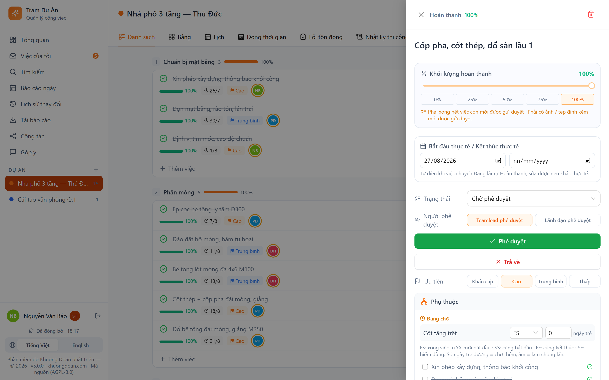

### Quy tắc nghiệm thu của dự án

Nút ☑ cạnh nút Thành viên dự án (Chủ sở hữu / Lãnh đạo đặt):

- Phải xong hết việc con mới được gửi duyệt.
- Phải có ảnh / tệp đính kèm mới được gửi duyệt.
- Người kiểm tra chất lượng (QC) được duyệt: chọn người → chỉ họ (và Lãnh đạo) duyệt được việc của dự
  án, Teamlead không duyệt.

Ứng dụng báo ngay khi thiếu; máy chủ cũng kiểm nên không lách được.

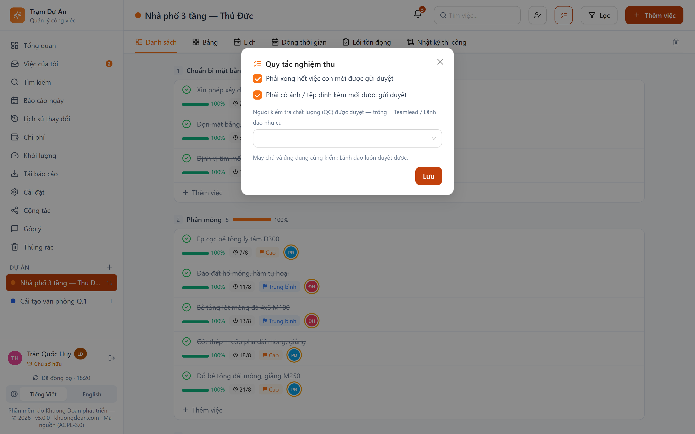

### Lỗi tồn đọng (punch list)

Tab **Lỗi tồn đọng** trong dự án → **Ghi nhận lỗi**: vị trí (tầng – trục – phòng), mô tả, mức độ, nhà thầu
chịu trách nhiệm, hạn khắc phục. Mở dòng lỗi để giao người, đính ảnh trước / sau, bình luận.

Vòng đời: **Đang mở** → **Đã sửa – chờ xác nhận** (nhà thầu báo xong) → **Đã xác nhận đóng** (QC xác
nhận). Quá hạn khắc phục tô đỏ. Lọc theo vị trí / nhà thầu / trạng thái. Mục KHÔNG ĐẠT trong bảng kiểm
nghiệm thu (mục 7) tự thành lỗi tồn đọng.

---

## 4. Dòng thời gian (Gantt), đường găng, kế hoạch gốc

- Mỗi việc một thanh từ ngày bắt đầu tới hạn. **Kéo thanh** để dời cả việc; kéo **mép** trái / phải để
  đổi ngày bắt đầu / hạn (cần quyền Giao việc). Thang Ngày / Tuần / Tháng ở góc phải.
- **Đường găng** (đỏ): chuỗi việc mà trễ 1 ngày là cả dự án trễ 1 ngày, tính theo **ngày làm việc**
  thật — đặt **Lịch làm việc** (ngày nghỉ hằng tuần, ngày lễ) để Chủ nhật không bị tính là ngày thi
  công. Đường nối = phụ thuộc; đỏ nét đứt = lịch đang vi phạm phụ thuộc.
- **Kế hoạch gốc**: Chủ sở hữu / Lãnh đạo bấm "Cập nhật kế hoạch gốc" để chụp lại lịch hiện tại làm
  mốc. Sau đó mỗi việc có thanh xám mảnh (kế hoạch) và số "+N ng" trễ. Lưu lần nữa thì bản cũ được giữ
  (BL0, BL1…, tối đa 10) — ô chọn bản để so.
- Thanh **xanh** mảnh = thực tế (từ ngày bắt đầu thực tế tới ngày kết thúc thực tế, hoặc tới hôm nay
  nếu chưa xong).
- Dòng chú giải hiện **KH đến hôm nay / Thực tế / SPI**: SPI < 1 là đang chậm so với kế hoạch gốc. Dưới
  biểu đồ là **đường S** kế hoạch – thực tế theo tuần.
- Trên điện thoại Gantt hiện dạng thẻ (tên, ngày, %, Găng); xoay ngang hoặc dùng máy tính để kéo thanh.

---

## 5. Báo cáo ngày

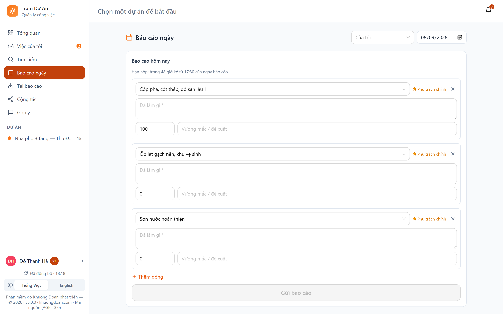

- Thanh bên → **Báo cáo ngày** → **Của tôi**. Phần mềm tự liệt kê các việc mình đang làm; với việc mình
  phụ trách chính, ô **% phần mình** ghi thẳng vào % hoàn thành của việc. Thêm dòng cho việc khác bằng
  "Chọn công tác…". Ghi **Đã làm gì** và **Vướng mắc / đề xuất**.
- Bấm **Gửi báo cáo**. Hạn nộp: trong 48 giờ kể từ 17:30 của ngày báo cáo. Chỉ chính mình sửa được báo
  cáo của mình; người khác chỉ bình luận.
- **Theo dõi nộp** (quản lý): lưới người × ngày, ✓ đã gửi, ✕ chưa. Bấm vào để đọc và bình luận; người
  được bình luận nhận thông báo. Người "Miễn báo cáo" không xuất hiện trong lưới.

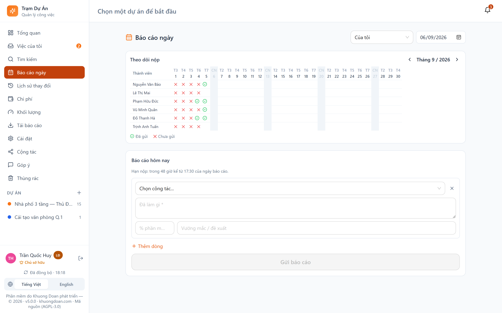

---

## 6. Nhật ký thi công

**Ai lập**: Chủ sở hữu, Lãnh đạo, Teamlead bộ phận Site trong dự án, và người được **Chỉ định người
lập**. Mỗi dự án mỗi ngày **một** nhật ký — người thứ hai bấm thêm cùng ngày sẽ được mở đúng bản đang
có để bổ sung.

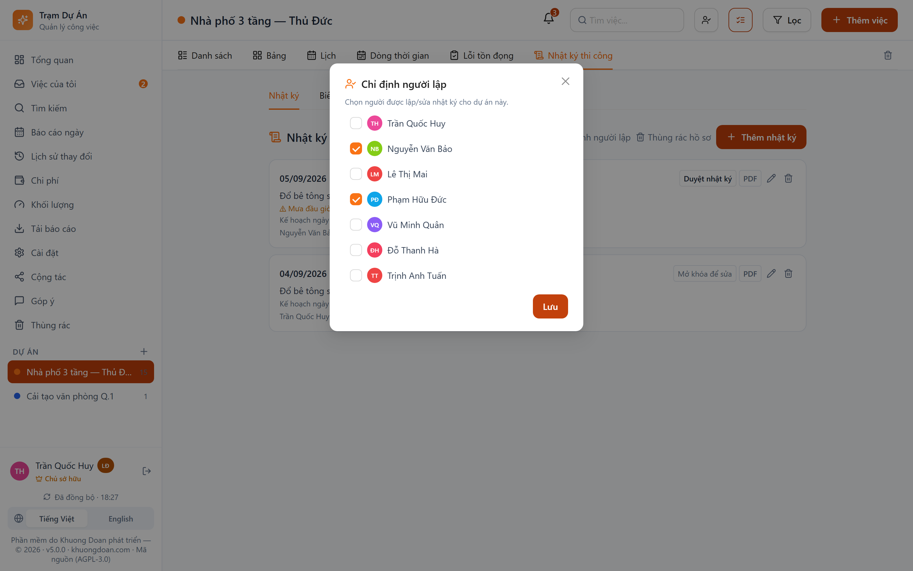

### Lập nhật ký (tab Nhật ký thi công → Thêm nhật ký)

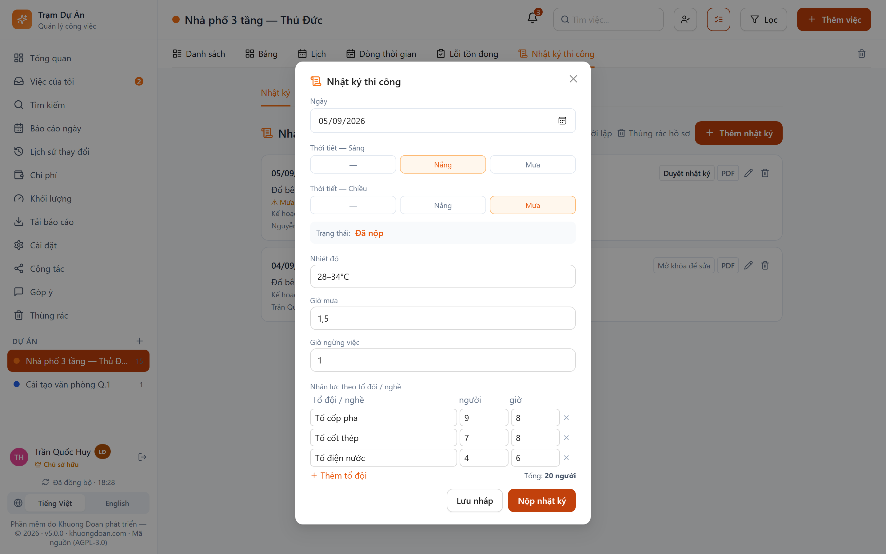

- Ngày; thời tiết sáng / chiều; nhiệt độ, giờ mưa, giờ ngừng việc.
- Bảng **Nhân lực** (tổ đội × số người × giờ), bảng **Máy móc** (tên × số lượng × giờ), bảng **Khối lượng**
  thi công trong ngày — chọn hạng mục từ BOQ để số cộng dồn được sang mục Chi phí (cột "Thi công (NK)").
- Ô chữ: Hạng mục + khối lượng (bắt buộc), Nhân lực, Thiết bị & vật tư, Vướng mắc ảnh hưởng tiến độ,
  Kế hoạch ngày tiếp theo. Bấm nút **micro** cạnh ô để nói thay vì gõ (Chrome trên điện thoại).
- **Có sự cố / mất an toàn trong ngày**: tick nếu có — mức độ, mô tả, khắc phục, người liên quan. Sự cố
  đi thẳng vào tab An toàn (HSE).
- Ý kiến TVGS / Chủ đầu tư.
- **Ảnh hiện trường**: bắt buộc ít nhất 1. "Chụp ảnh" mở thẳng camera sau; ảnh tự thu nhỏ trước khi
  gửi. Nhật ký đã duyệt thì không thêm ảnh được nữa.

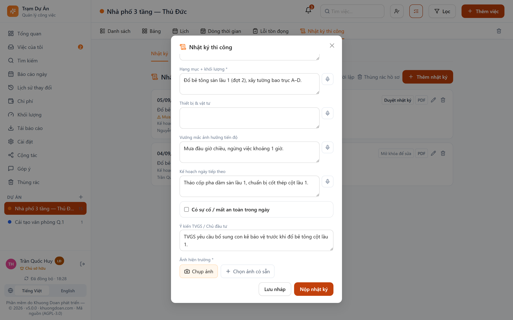

### Trạng thái

**Nháp** ("Lưu nháp") → **Đã nộp** ("Nộp nhật ký") → **Chỉ huy trưởng đã duyệt** ("Duyệt nhật ký" — Chủ
sở hữu / Lãnh đạo / Teamlead Site). Đã duyệt = khóa sửa. Chỉ Chủ sở hữu / Lãnh đạo bấm **Mở khóa để
sửa**; họ sửa bản đã duyệt thì con dấu giữ nguyên nhưng ghi rõ ai sửa lúc nào (Nhật ký máy chủ). Người
duyệt nhận thông báo khi có nhật ký nộp; người lập nhận thông báo khi được duyệt / mở khóa. Nút **PDF**
in nhật ký.

Lưu ý: mở một nhật ký mà người khác vừa sửa xong thì khi bấm Lưu sẽ được báo "vừa được … sửa — mở lại
bản mới rồi bổ sung", không đè. Xóa nhật ký: vào **Thùng rác hồ sơ** 90 ngày (khôi phục được).

---

## 7. Biên bản, bảng kiểm nghiệm thu, An toàn (HSE)

### Biên bản

Tab **Biên bản** (trong Nhật ký thi công) → **Thêm biên bản**:

- **Loại**: Biên bản hiện trường, Biên bản họp, Chỉ thị, Nghiệm thu nội bộ, An toàn đầu giờ, Giấy phép
  làm việc — Chủ sở hữu thêm loại riêng của công ty trong Cài đặt.
- **Số hiệu**: để trống thì tự cấp "BB-01/2026" tăng dần theo dự án.
- **Bảng kiểm** (loại Nghiệm thu / An toàn / Giấy phép): chọn mẫu có sẵn (nghiệm thu cốp pha, cốt
  thép…), chấm từng mục **Đạt / Không đạt / N/A**, ghi chú chỗ không đạt. Mục Không đạt tự tạo lỗi tồn
  đọng khi lưu.
- Đính kèm PDF / ảnh. Ai xem được tệp: Chủ sở hữu, Lãnh đạo, Teamlead, và người trong dự án khi Cài đặt
  bật "Chỉ người trong dự án xem được tệp / biên bản / nhật ký".
- Biên bản đã lưu **không sửa được** trong ứng dụng; lập sai thì xóa (vào Thùng rác hồ sơ 90 ngày) rồi
  lập lại.

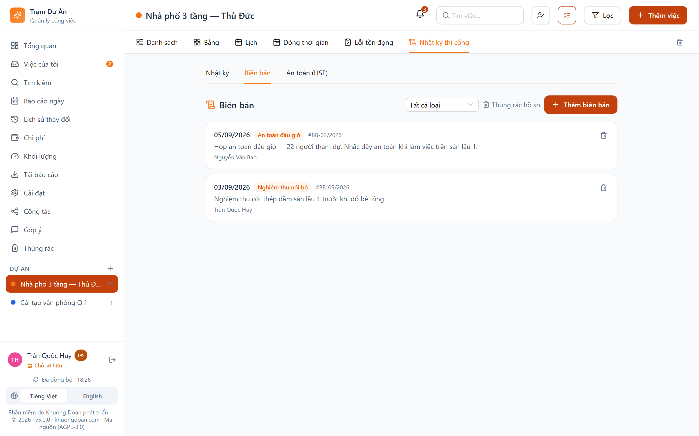

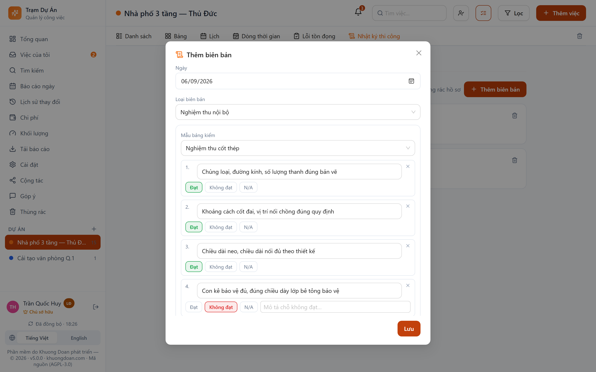

### An toàn (HSE)

Tab **An toàn (HSE)**: ngày không tai nạn, số sự cố, sổ sự cố (lấy từ nhật ký), họp an toàn đầu giờ và
giấy phép làm việc trong 7 ngày (lấy từ biên bản loại tương ứng).

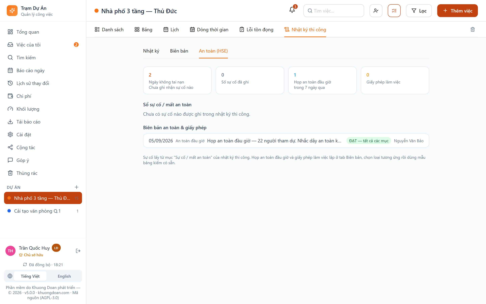

---

## 8. Chi phí: hợp đồng, BOQ, kỳ nghiệm thu, đề nghị thanh toán

Cần quyền **Chi phí** (xem) và **Sửa chi phí** (nhập). Chọn dự án ở ô "Dự án:" phía trên; để "Tất cả dự
án" xem bảng tổng hợp. Năm tab: Chủ đầu tư · Thầu phụ / NCC · BOQ & Khối lượng · Chi phí thực tế · Dòng
tiền.

### Chủ đầu tư, Thầu phụ / NCC

Hợp đồng (số, giá trị), phụ lục, các đợt **Đề nghị thanh toán đã gửi** và các đợt **Chủ đầu tư đã thanh
toán** ("Thêm đợt"). Thầu phụ / NCC: hợp đồng thầu phụ gắn với hợp đồng CĐT, các đợt đã trả. Hợp đồng
không gắn dự án = hợp đồng khung, ai xem chi phí cũng thấy.

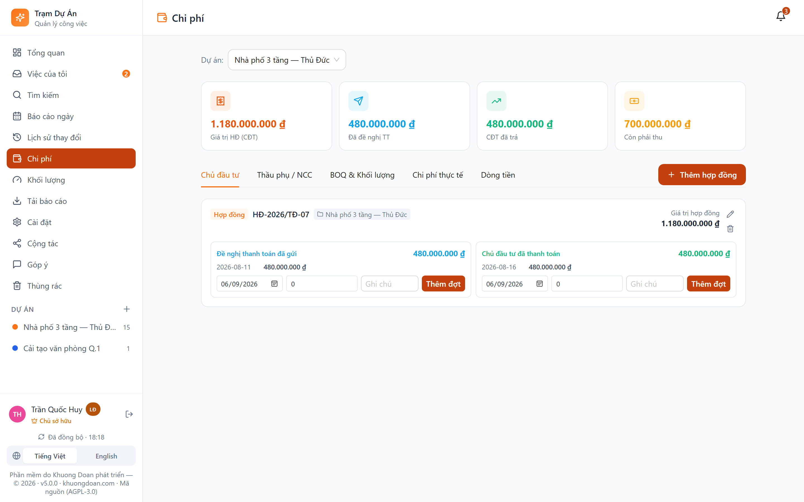

### BOQ & Khối lượng

- Thêm hạng mục từng dòng, hoặc **Nhập từ Excel (CSV)**: dán các cột STT, Tên, ĐVT, KL hợp đồng, Đơn
  giá. Dòng chỉ có tên = dòng nhóm (Phần I, II…).
- Liên kết mỗi hạng mục với công việc → nút gợi ý KL kỳ này từ % tiến độ (trung bình có trọng số theo số
  ngày của việc).
- **Kỳ nghiệm thu**: "Kỳ mới", đặt ngày chốt, nhập KL kỳ này từng hạng mục; bảng tự tính LK trước / Lũy
  kế / % / Giá trị thực hiện. **Xuất CSV kỳ này** ra bảng nghiệm thu mở bằng Excel.
- **Khóa kỳ** khi đã nộp Chủ đầu tư: số liệu và đơn giá của kỳ đó bị chốt (đổi đơn giá sau này chỉ áp
  cho kỳ sau). Mở khóa phải ghi lý do — có vết trong Nhật ký máy chủ.
- **Phát sinh (VO)**: "Thêm phát sinh" → dòng VO-01… trạng thái Đề xuất / Đã duyệt / Từ chối; chỉ VO đã
  duyệt tính vào giá trị hợp đồng (dòng vàng nhắc số VO chưa duyệt).
- Cột **Thi công (NK)**: khối lượng cộng dồn từ nhật ký thi công — so với Lũy kế nghiệm thu để biết còn
  bao nhiêu chưa nghiệm thu. Cột **Đã đề nghị TT**: lũy kế các kỳ đã lập đề nghị thanh toán.
- **Đề nghị thanh toán** (khung dưới thanh kỳ): số đề nghị, ngày, % giữ lại bảo hành, % khấu trừ tạm
  ứng, % VAT, và **cách tính VAT** (trên giá trị sau giữ lại & khấu trừ, hoặc trên giá trị kỳ). Số "Số
  tiền đề nghị thanh toán" là số đưa vào hồ sơ.

### Chi phí thực tế, Dòng tiền

Ngân sách theo nhóm (vật tư, nhân công, máy, thầu phụ, chung, khác), sổ chi phí thực tế (ngày, nhóm, mô
tả, số tiền, chứng từ, NCC), cam kết thầu phụ, lãi gộp tạm tính. Dòng tiền: thu vào / chi ra / ròng theo
tháng, lũy kế.

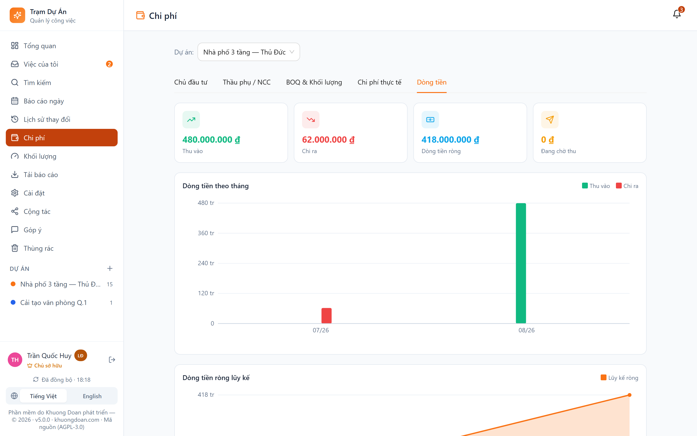

**Nhiều người cùng làm**: QS sửa dự án A và Kế toán ghi dự án B cùng lúc đều được lưu. Chỉ khi hai người
cùng sửa **một** dự án, người sau được báo "xung đột" kèm tên dự án — tải lại rồi nhập lại phần của mình.

---

## 9. Tổng quan, Khối lượng, Lịch sử, Thông báo, Tải báo cáo, Góp ý

- **Tổng quan**: tổng việc, đã xong, quá hạn, tiến độ; phân bổ theo người; theo ưu tiên; việc sắp tới
  hạn. Chủ sở hữu / Lãnh đạo có thêm thẻ **Sức khỏe vận hành (30 ngày)**: % nhật ký nộp đúng hạn, % báo
  cáo ngày đúng hạn, số kỳ nghiệm thu tháng này, việc hoàn thành 30 ngày (ảnh ở mục 0).
- **Khối lượng**: số việc đang mở của mỗi người — đỏ = quá tải.

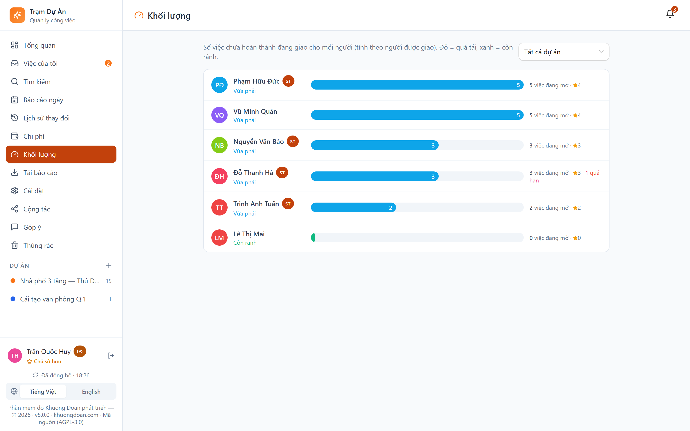

- **Lịch sử thay đổi**: **Lịch sử ứng dụng** (ai giao việc, đổi hạn, %, trả về…) và **Nhật ký máy chủ**
  (Chủ sở hữu / Lãnh đạo): mọi thay đổi do máy chủ ghi, không ai xóa được — kể cả chi phí, khóa / mở khóa
  kỳ, duyệt nhật ký. Đầu trang có "Ai sửa gì 7 ngày qua".

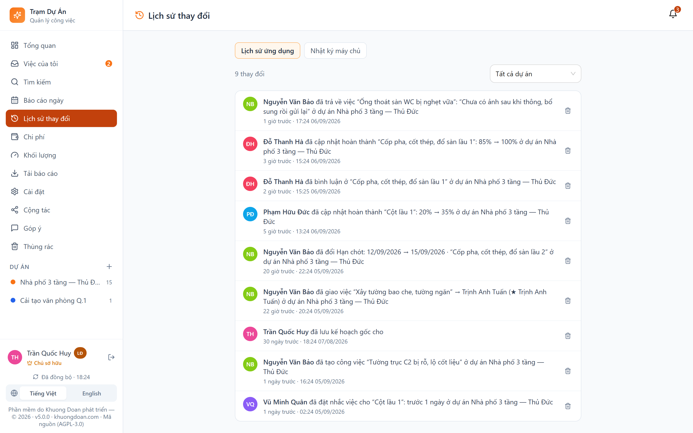

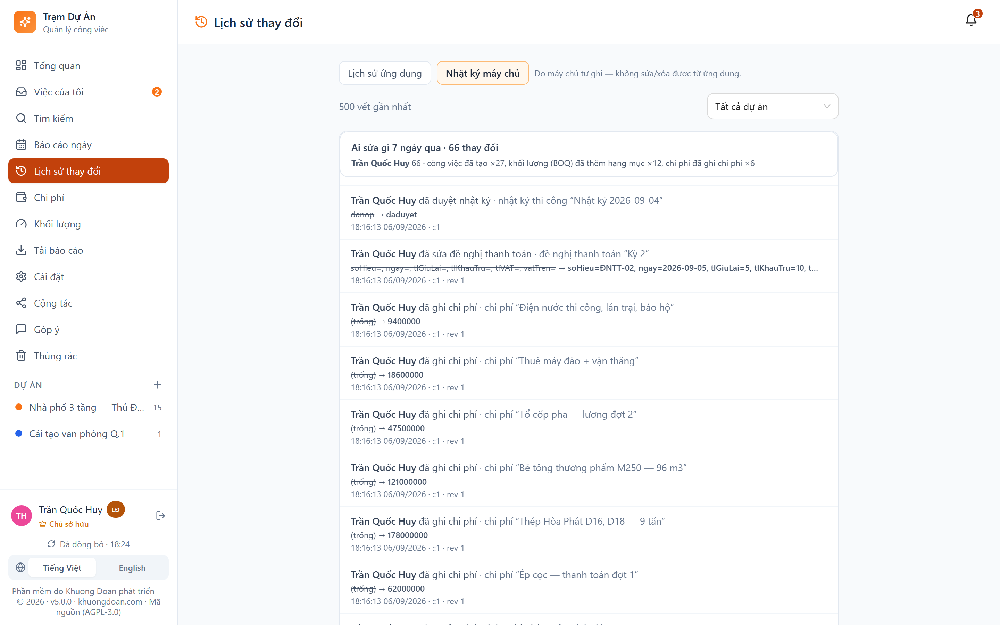

- **Thông báo** (chuông): được giao việc, việc bị trả về, việc chờ mình duyệt, nhật ký chờ duyệt / đã
  duyệt / mở khóa, việc quá hạn, bình luận vào báo cáo của mình. Bấm vào để mở đúng chỗ; mở chuông là
  đánh dấu đã đọc.

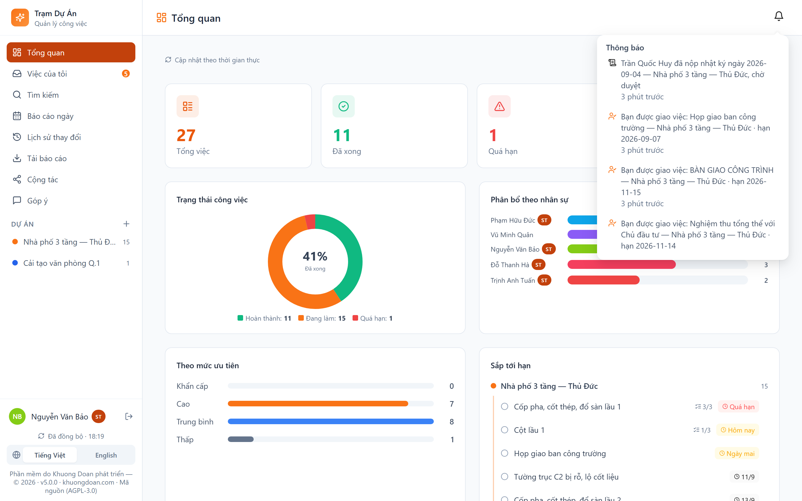

- **Tải báo cáo**: xuất báo cáo dự án (hoặc toàn bộ) dạng HTML in được / lưu PDF từ trình duyệt.
- **Góp ý**: viết điều gì làm bạn phải mở Excel / Zalo thay vì phần mềm — Chủ sở hữu nhận qua email và
  tệp góp ý trên máy chủ.

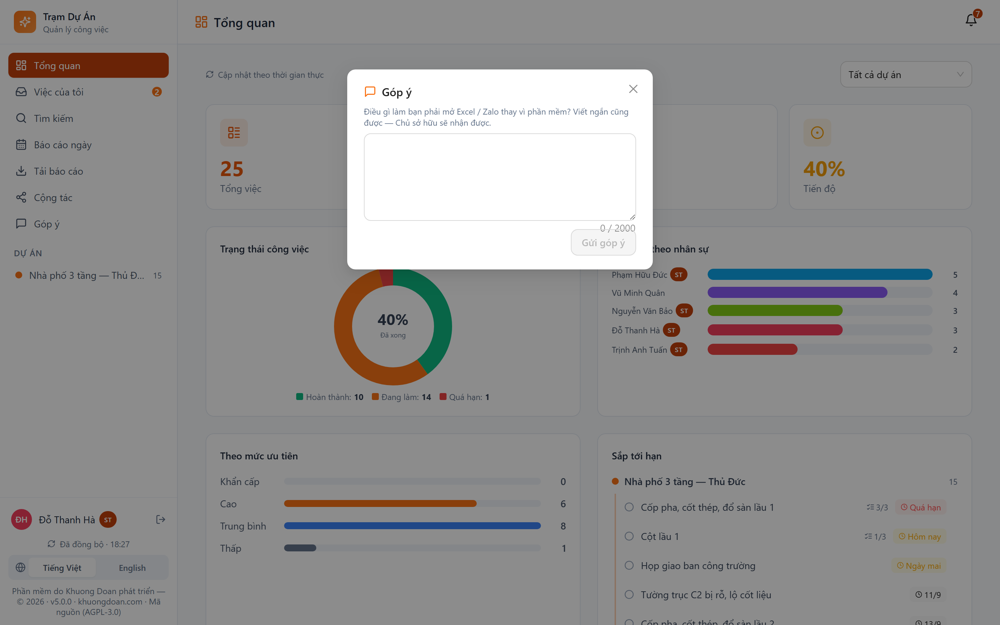

---

## 10. Cài đặt (Chủ sở hữu) và quản lý thành viên

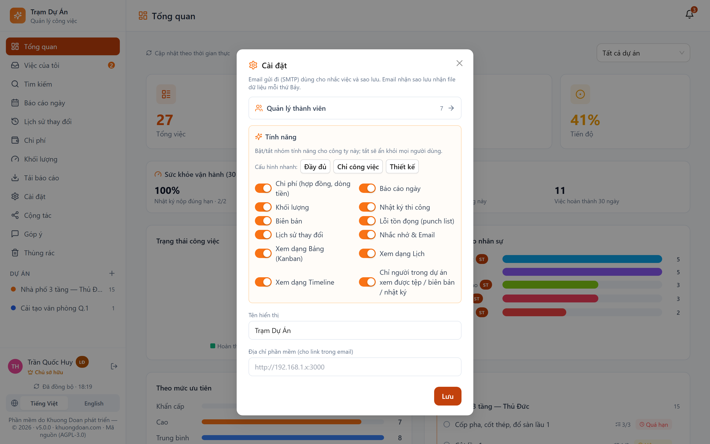

- **Quản lý thành viên**: tạo tài khoản (tên, email, mật khẩu ≥ 8 ký tự có chữ và số, bộ phận), tick
  quyền (mục 1), đặt lại mật khẩu (ổ khóa), gỡ tài khoản (phần mềm tự gỡ người đó khỏi dự án / việc).
- **Tính năng**: bật / tắt từng nhóm (Chi phí, Báo cáo ngày, Nhật ký, Biên bản, Lỗi tồn đọng, Lịch sử,
  Nhắc nhở & Email, các kiểu xem…) hoặc chọn cấu hình nhanh Đầy đủ / Chỉ công việc / Thiết kế.
- Tên phần mềm, địa chỉ mở phần mềm (in trong email), loại biên bản riêng của công ty.
- **Sao lưu tự động** (mỗi thứ Bảy) vào email nhận sao lưu; **Email gửi đi (SMTP)** cho nhắc việc, sao
  lưu, cảnh báo.
- **Sức khỏe máy chủ**: phiên bản, kích thước dữ liệu, snapshot gần nhất, đĩa trống, email, sao lưu, PWA
  — có cảnh báo khi cần.

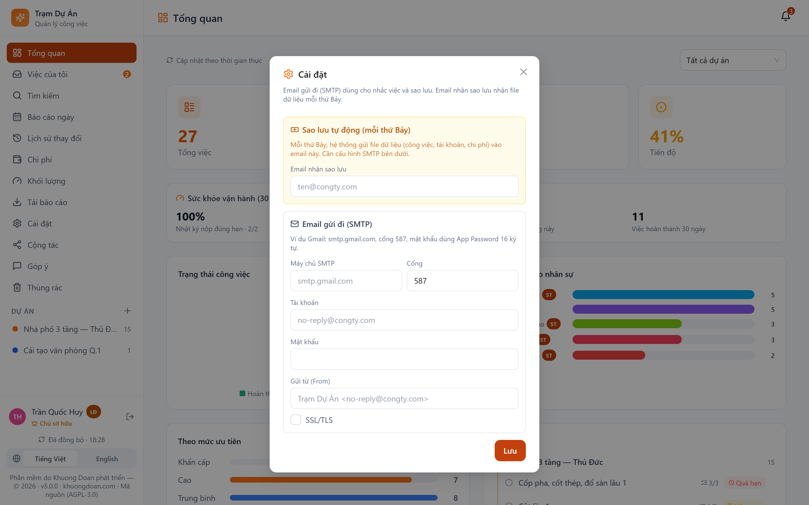

Trong dự án: Thành viên dự án, Quy tắc nghiệm thu, Chỉ định người lập nhật ký (mục 1, 3, 6). **Thùng
rác**: khôi phục / xóa vĩnh viễn việc và dự án đã xóa (90 ngày).

---

## 11. Dùng trên điện thoại, khi mất mạng

&nbsp;&nbsp;
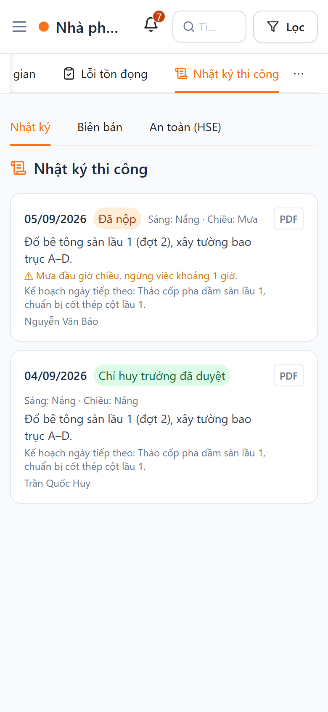

- Mở địa chỉ phần mềm bằng Chrome / Safari; "Thêm vào màn hình chính" để có biểu tượng như app. Nút ☰
  mở thanh bên.
- Danh sách, BOQ, Gantt hiện dạng thẻ cho vừa màn hình. Nhật ký thi công: chụp ảnh thẳng từ camera, nói
  thay gõ bằng nút micro.
- **Mất mạng**: nhãn góc dưới đổi thành "CHƯA LƯU — mất kết nối". Thay đổi được giữ trong máy và tự gửi
  khi có mạng — giữ trang mở tới khi thấy "Đã đồng bộ". Nếu trên máy chủ đã có bản mới hơn, phần mềm báo
  thay đổi ngoại tuyến bị bỏ để bạn nhập lại.
- Máy chủ chạy HTTPS thì trang mở được cả khi mất mạng (chỉ để xem).

---

## 12. Câu hỏi thường gặp

| Tình huống | Làm gì |
|---|---|
| Không kéo được % hoàn thành | Chỉ người phụ trách chính (★) hoặc người có quyền Giao việc sửa được. Nhờ người giao việc đặt bạn làm phụ trách chính |
| Gửi duyệt bị báo "chưa có ảnh / còn việc con" | Dự án có Quy tắc nghiệm thu. Đính ảnh / tick xong việc con trước |
| Không thấy dự án mà đồng nghiệp thấy | Dự án đó đã giới hạn Thành viên dự án. Nhờ Chủ sở hữu / Lãnh đạo thêm bạn |
| Nhật ký báo "đã được duyệt — khóa sửa" | Nhờ Chủ sở hữu / Lãnh đạo mở khóa (có vết), sửa xong nộp lại |
| Lưu nhật ký báo "vừa được … sửa" | Người khác vừa lưu trước bạn. Đóng, mở lại bản mới rồi bổ sung |
| Lưu chi phí báo "xung đột" kèm tên dự án | Hai người cùng sửa một dự án. Tải lại (Ctrl+R) rồi nhập lại phần của bạn; số của người kia đã được giữ |
| Chuyển việc sang dự án khác bị từ chối | Dự án đích nằm ngoài phạm vi của bạn (Thành viên dự án) |
| Quên mật khẩu | Chủ sở hữu (hoặc người có quyền Tạo tài khoản) đặt lại trong Quản lý thành viên. Chủ sở hữu quên: xem "BẢO MẬT - Quên mật khẩu quản trị" trong gói |
| Email nhắc việc không tới | Máy chủ chưa cấu hình email gửi đi, hoặc bị chặn spam. Chủ sở hữu xem Cài đặt → Sức khỏe máy chủ |
| Muốn biết ai đã sửa số này | Lịch sử thay đổi → Nhật ký máy chủ (Chủ sở hữu / Lãnh đạo), lọc theo dự án |
| Đổi sang tiếng Anh | Nút "English" cuối thanh bên |

Góp ý về hướng dẫn này: nút **Góp ý** trong phần mềm.

---

Phần mềm do Khuong Doan phát triển — https://khuongdoan.com/ · Mã nguồn (AGPL-3.0):
https://github.com/2ez4gcx/Project-hub
